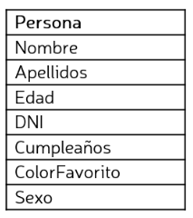

# Desarrollo-Full-Stack-Angular
 Ejercicio práctico del curso Samsung Desarrollador@s, dónde he aprendido competencias de desarrollo web.
Práctica 6. Angular
Se propone generar un formulario con Angular que permita crear, editar, modificar y borrar un listado de personas.

Para ello se puede utilizar la clase creada en la práctica de TypeScript, Persona, aunque no será necesario proporcionar los campos Dirección, Teléfono y Mail.

A la hora de crear o editar una persona será necesario realizar las siguientes validaciones sobre los datos:

Se ha de poder dar de alta nuevas personas y visualizarlas en una lista.
Todos los registros han de poder modificarse.
Todos los registros han de poder borrarse.
Se ha de utilizar angular-material.
Las fechas han de mostrarse en formato dd/mm/aaaa.
Se comprobará que el DNI tenga 9 caracteres.
Se comprobará que el Nombre, Apellidos y ColorFavorito tengan al menos 3 caracteres.
Se comprobará que la edad esté comprendida entre 0 y 125.
El sexo ha de seleccionarse entre los valores Hombre, Mujer, Otro y No especificado.
